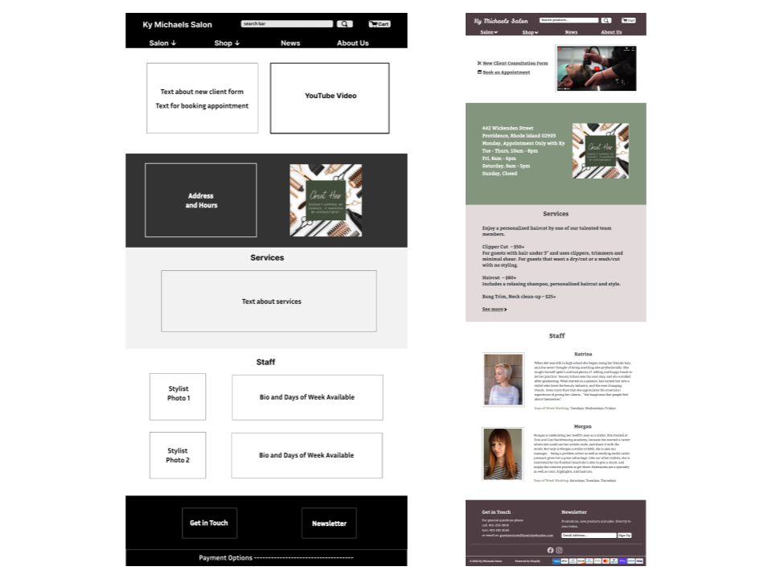
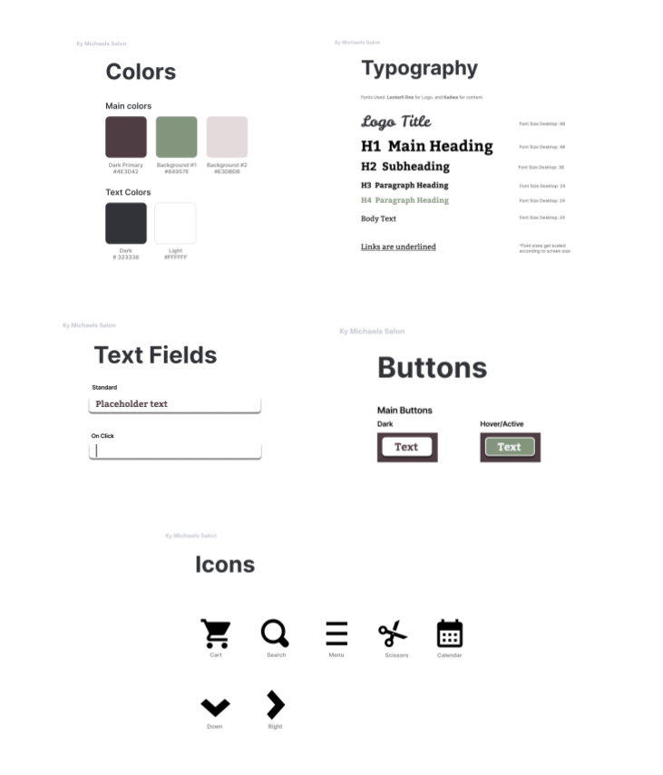

# Ky Micheals Salon Homepage Redesign

### Objective:
The objective of the responsive redesign project was to improve the usability of the Ky Michaels Salon homepage through responsive web design techniques.

In the redesign, all buttons are dummy buttons. This project's purpose is to learn how to build a responsive webpage that accomodates for different screen sizes. Its purpose was also to gain practice coding HTML and CSS by hand, without the help of external libraries or frameworks.

Link to Original Webpage:
https://kymichaelssalon.com/

Link to my Redesign:
https://prlakshm.github.io/kymicheals/

### About Salon Homepage:

Ky Michaels Salon is a small business on Wickenden Street in Providence. Their homepage is the first page you see when you click on their website. It lists the salon’s hours, address, and other important information about the salon.

Ky Michaels Salon is the salon I go to in Providence to cut my hair, but I usually call in because their website is hard to navigate and there is no link to book an appointment. I chose to redesign the homepage to help make the website interaction easier.

#### Usability Issues:
- Embedded YouTube video first thing on homepage. Takes up most of page. so inefficient and have to scroll to access main information.
- Title on the browser tab is “Best Salon in Rhode Island color specialists precision cutting,” and not salon name. Makes tab harder to navigate to.
- Booking an appointment and pricing information are hard to find. Have to use dropdown menu.
- Inconsistent drop-down menus in the header. Some have drop-down menu options and other do not. No indication which ones do.
- Lack of a "Shop" option and unclear product categorization. Products categorized by brand name (e.i. “R+CO,” “Shu Uemura,” “Kerastase,” “Oribe”), and don't immediately know they're names of hair brands.
- Homepage only includes hours and address. Some stylists only work certain days, so misleading.

#### Accessibility Issues:
- Webpage is not well-adapted for screen readers. Not all body text is read and cannot navigate through text using arrow keys .
- Missing alternative text for images.
- Low contrast icons in the footer of payment options accept.

### Speed Sketching:
I used speed sketching to think of new designs for my webpage. This technique helped me flush out ideas! I then created a final sketch of my webpage on paper.

### Figma Wireframes:
Low-fidelity wireframes are basic representations of a digital interface. They map out general layout of sections/objects. I created low-fidelity wireframes at the beginning of my design process using Figma.

High-fidelity wireframes are representations of the polished, final design. They employ components of the visual style guide, like fonts, colors, buttons, and input boxes. I also created  high-fidelity wireframes using Figma.

The wireframes I made inlcuded versions for desktop, tablet, and mobile phone screen sizes. Desktop is shown below (low-fi on left and high-fi on right). 

### Visual Design Style Guide:
My style guide details the "look" of my webpage. It mapped out my desired colors, typography, icons, buttons, input feilds.

#### Check out my redesign here: https://prlakshm.github.io/kymicheals/

